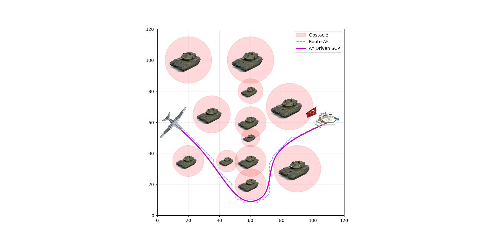

# UAV Trajectory Planning with A* and Convex Optimization

This project implements a hybrid path planning algorithm for Unmanned Aerial Vehicles (UAVs) operating in obstacle-dense environments. 
It combines the **A* search algorithm** for global pathfinding with **Convex Optimization (CVXPY)** for trajectory smoothing and obstacle avoidance.

